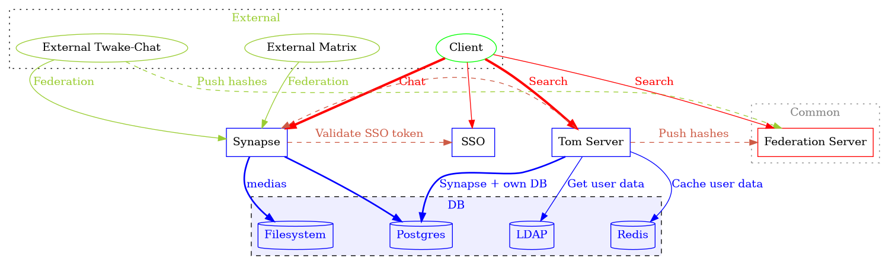

# Twake-Chat Matrix extension server

<br />
<div align="center">
  <a href="https://github.com/linagora/twake-on-matrix">
    
  </a>


  <p align="center">
    <a href="https://twake-chat.com">Website</a>
    •
    <a href="https://beta.twake.app/web/#/rooms">View Demo</a>
    •
    <a href="https://github.com/linagora/twake-on-matrix/issues">Report Bug</a>
    •
    <a href="https://hosted.weblate.org/projects/linagora/twake-matrix/#repository">Translate Twake></a>
</p>
</div>

---

This repository is a multi-packages repository. See [Modules](#modules) for details.

**ToM server** enhances a [Matrix Synapse server](https://github.com/element-hq/synapse) with several features:
 * first, **Tom** is a [Matrix Identity Server](https://spec.matrix.org/latest/identity-service-api/) but with additional features:
   * inside an organization, it adds some search APIs that allows to find internal users like do the mail clients, for autocompletion for example
   * it extends also [Matrix Identity Service](https://spec.matrix.org/latest/identity-service-api/) search responses by adding inactive users
 * it provide also an "application service" that allows administrator to create channels with automatic join
 * it implements also the [federated identity mechanism](https://github.com/matrix-org/matrix-spec-proposals/pull/4004) that extend the
   [Matrix Identity Service](https://spec.matrix.org/latest/identity-service-api/) to join Matrix identity services to provide a better search

Here is the architecture principle:



REST API Endpoints documentation is available on https://linagora.github.io/ToM-server/

[Try it with docker](#twake-chat-docker)

## Development

The local instance will be started using `docker.localhost` as root domain. Please make sure that your hosts file contains:

```conf
127.0.0.1 docker.localhost auth.docker.localhost matrix.docker.localhost tom.docker.localhost
```

```bash
# pushd .compose/ssl/
# mkcert -install
# mkcert docker.localhost *.docker.localhost
# cat docker.localhost+1.pem docker.localhost+1-key.pem > both.pem
# popd

pushd .compose/
echo -e "TZ=$(timedatectl show | grep -Poh '(?<=^Timezone=).*')\nUID=$(id -u)\nGID=$(id -g)" > .env

## OR - manual edition
# cp .env.template .env
# $EDITOR .env
popd

pushd .compose/lemon
./init-db.sh  # Creates a user 'dwho' with pass 'dwho'

## Add a new user
# defaults -> ./create-user.sh 'dwho' 'Doctor Who' 'dwho'
# ./create-user.sh 'nickname' 'givenname' 'password'
popd

docker-compose up # -d
# docker compose up # -d
```

## Scripts

* `npm run build`: build all packages
* `npm run test`: test all packages

## Modules

* [@twake/matrix-identity-server](./packages/matrix-identity-server):
  [Matrix Identity Service](https://spec.matrix.org/v1.6/identity-service-api/) implementation for Node.js
* [@twake/matrix-client-server](./packages/matrix-client-server/):
  [Matrix Client-Server](https://spec.matrix.org/v1.11/client-server-api/) implementation for Node.js
* [@twake/matrix-invite](./packages/matrix-invite): matrix invitation web application
* [@twake/server](./packages/tom-server): the main Twake Chat Server, extends [@twake/matrix-identity-server](./packages/matrix-identity-server)
* [@twake/federated-identity-service](./packages/federated-identity-service): Twake Federated Identity Service
* [@twake/config-parser](./packages/config-parser): simple file parser that uses also environment variables
* [@twake/crypto](./packages/crypto): cryptographic methods for Twake Chat
* [@twake/logger](./packages/logger): logger for Twake
* [@twake/utils](.packages/utils): utilitary methods for Twake Chat
* [@twake/matrix-application-server](./packages/matrix-application-server): implements
  [Matrix Application Service API](https://spec.matrix.org/v1.6/application-service-api/)
* [matrix-resolve](./packages/matrix-resolve): resolve a Matrix "server name" into base URL following
  [Matrix specification](https://spec.matrix.org/latest/server-server-api/#server-discovery)
* [@twake/retry-promise](packages/retry-promise): simple module extending javascript Promise with retry strategy

## Twake-Chat docker

This repository provides different docker images. The main is [Tom Server](./Dockerfile) itself. Here are its environment variables:

* Required:
  * `BASE_URL`: Public URL
  * Database:
    * `DATABASE_ENGINE` _(`pg` or `sqlite`)_
    * `DATABASE_HOST` _(path for `sqlite`)_
    * `DATABASE_NAME`
    * `DATABASE_USER`
    * `DATABASE_PASSWORD`
    * `DATABASE_SSL`
  * `OIDC_ISSUER`: URL of SSO server
  * LDAP service:
    * `LDAP_BASE`
    * `LDAP_FILTER`
    * `LDAP_USER`
    * `LDAP_PASSWORD`
    * `LDAP_URI`
  * Matrix server:
    * `SERVER_NAME` _(same value than in Matrix's homeserver.yaml)_
    * `MATRIX_SERVER` _(real Matrix server)_
  * `TEMPLATE_DIR` _(default: `node_modules/@twake/server/templates`)_
* Recommended:
  * `ADDITIONAL_FEATURES`: set true to have all search features; false for a public instance
  * Cron service:
    * `CRON_SERVICE` _(default: true)_: enable cron tasks
    * `PEPPER_CRON` _(default: `9 1 * * *`)_
    * `UPDATE_USERS_CRON` _(default: `*/15 * * * *`)_
    * `UPDATE_FEDERATED_IDENTITY_HASHES_CRON` _(default: `3 3 * * *`)_
  * Logs:
    * `LOG_TRANSPORTS`: set to `Console`
    * `LOG_LEVEL`: default to "error", possible values: "error", "warn", "info", "http", "verbose", "debug", "silly"
  * `TRUSTED_PROXIES`: IP list of server allowed to set `X-Frowarded-For` header
  * Rate limits _(see [express-rate-limit](https://www.npmjs.com/package/express-rate-limit))_:
    * `RATE_LIMITING_WINDOW`
    * `RATE_LIMITING_NB_REQUESTS`
* Optional:
  * `FEDERATED_IDENTITY_SERVICES`: list of federated identity services
  * Use a CrowdSec service:
    * `CROWDSEC_URI`
    * `CROWDSEC_KEY`
  * Add Jitsi into metadata:
    * `JITSI_BASE_URL`
    * `JITSI_JWT_ALGORITHM`
    * `JITSI_JWT_ISSUER`
    * `JITSI_SECRET`
    * `JITSI_PREFERRED_DOMAIN`
    * `JITSI_USE_JWT`
  * Matrix database _(for automatic channels)_:
    * `MATRIX_DATABASE_ENGINE`
    * `MATRIX_DATABASE_HOST`
    * `MATRIX_DATABASE_NAME`
    * `MATRIX_DATABASE_PASSWORD`
    * `MATRIX_DATABASE_SSL`
    * `MATRIX_DATABASE_USER`
  * Opensearch features:
    * `OPENSEARCH_CA_CERT_PATH`
    * `OPENSEARCH_HOST`
    * `OPENSEARCH_IS_ACTIVATED`
    * `OPENSEARCH_MAX_RETRIES`
    * `OPENSEARCH_NUMBER_OF_SHARDS`
    * `OPENSEARCH_NUMBER_OF_REPLICAS`
    * `OPENSEARCH_PASSWORD`
    * `OPENSEARCH_SSL`
    * `OPENSEARCH_USER`
    * `OPENSEARCH_WAIT_FOR_ACTIVE_SHARDS`

## Copyright and license

Copyright (c) 2023-present Linagora <https://linagora.com>

License: [GNU AFFERO GENERAL PUBLIC LICENSE](./LICENSE)
